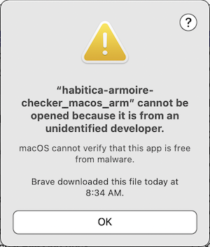
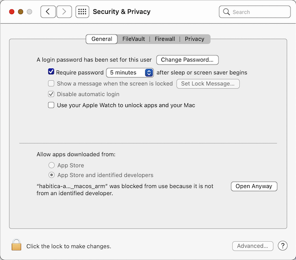
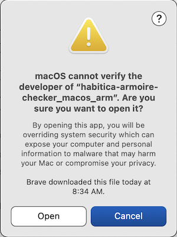

Habitica Armoire Checker

### Install
- Go to the [Releases page](https://github.com/SunSparc/habitica-armoire-checker/releases) and pick from the list the version that you need for your CPU and operating system.
- Click the filename and save that file to your computer.
- Open the location on your computer where you saved the file.
- If the file was not automatically unzipped, unzip it now. (Try double-clicking it.)
- Double-click the unzipped file.

---

*macOS*
- When you double-click the file you will probably see a warning indicating that the application is from an unidentified developer.

- Click "Ok".
- Open System Preferences and go to the "Security & Privacy" section.
- Make sure that you are on the "General" tab.

- On the bottom portion of the Security & Privacy pane, you should see a message with the name of the file you just downloaded and tried to open.
- There will be a button to the right of that message that has the text "Open Anyway" on it.
- Click that button.
- You should then see another warning about macOS not being able to verify the developer.

- Click "Open".
- This security process should only happen the first time you download and try to run the Habitica Armoire Checker application.
- If you download another version, you will need to go through the same process again.
